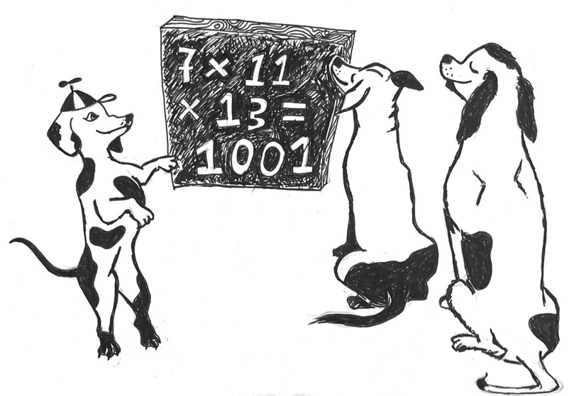

<h2> UW Math Olympiad in  San Francisco (aka BAMOLO)</h2> 

[The UW Math Olympiad](https://sites.math.washington.edu/~mathcircle/olympiad/) is a unique math contest, one where participants *talk out loud* to judges to explain their work. It started nearly 20 years in Seattle, and now this exciting event will debut, in June 2026, in San Francisco and New York City.

[Registration](https://forms.gle/iQr63J29p8kH8icH6) is open now! Space is very limited (we will probably limit attendance for our first year to 40 participants), so do not register unless you are sure you will attend.

For more information, go [here](more-info.md).

Here is some basic information about the SF event, nicknamed *BAMOLO* (Bay Area Math Out Loud Olympiad).
- **When** Sunday, June 7, 900AM--3:30PM
- **Where** [Proof School](https://www.proofschool.org),  221 Main Street, near Embarcadero BART.
- **Who** Math-loving students in grades 6-10 (ages 10-15) who want to think about challenging fun problems and explain their reasoning to friendly older mathematiciana.
- **What** For our first SF pilot, we plan to follow the excellent example of the UW Olympiad, so please visit their [site](https://sites.math.washington.edu/~mathcircle/olympiad/) for more information as well.  The creators of the UW Olympiad wrote an excellent book, [*Math Out Loud*](https://www.amazon.com/Math-Out-Loud-Olympiad-Mathematical/dp/1470466937/ref=sr_1_1?dib=eyJ2IjoiMSJ9.mphTk2EUHt4wzZ_GS2dImA.jYIkJaHtWQU_sFfLtLib1TMxcyM5onHWMwUIyHOa3KI&dib_tag=se&keywords=9781470466930&linkCode=qs&qid=1772941221&s=books&sr=1-1), which we strongly recommend.

If you want to stay in touch without registering,  add your email to our [mailing list](https://forms.gle/uk6tus8tYFVwvq8Y8), and we will send you more information periodically.  
