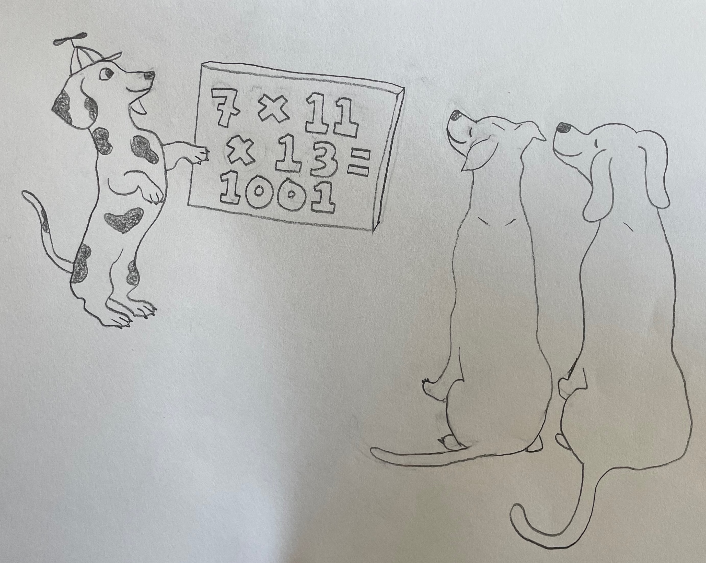

<h2> UW Math Olympiad: SF</h2>

[The UW Math Olympiad](https://sites.math.washington.edu/~mathcircle/olympiad/) is a unique math contest, one where participants *talk out loud* to judges to explain their work. It started nearly 20 years in Seattle, and now this exciting event will debut, in June 2026, in San Francisco and New York City.

Here is some basic information about the SF event.
- **When** Sunday, June 7, 930AM--3PM
- **Where** [Proof School](https://www.proofschool.org),  221 Main Street, near Embarcadero BART.

Please visit this website for more information, and add your email to our [mailing list](https://forms.gle/uk6tus8tYFVwvq8Y8), and we will send you more information soon about registering, etc.  We plan to follow the excellent example of the UW Olympiad, so please visit their site for more information as well.
