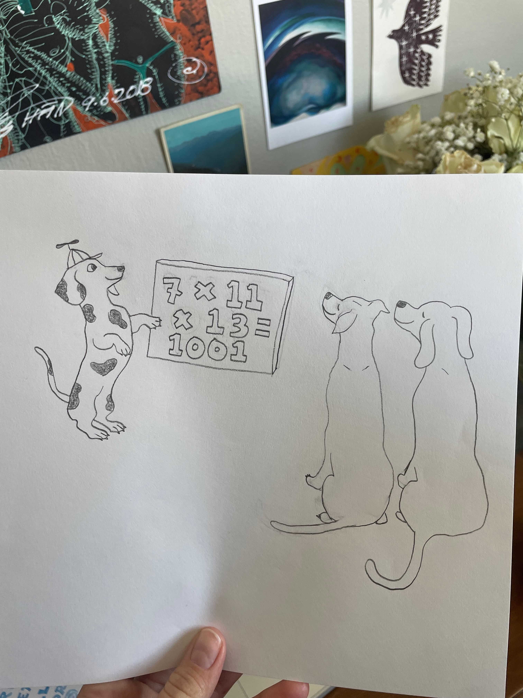

<h2> UW Math Olympiad: SF</h2>

[The UW Math Olympiad](https://sites.math.washington.edu/~mathcircle/olympiad/) is a unique math contest, one where participants *talk out loud* to judges to explain their work. It started nearly 20 years in Seattle, and now this exciting event will debut, in June 2026 in San Francisco and New York City.

